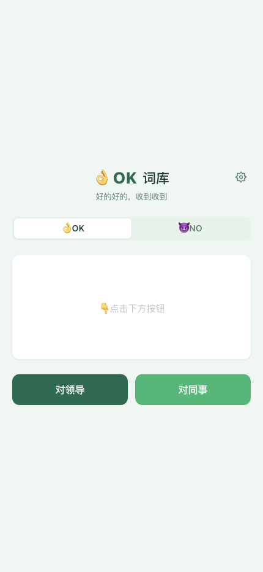
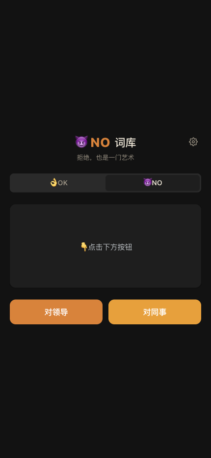
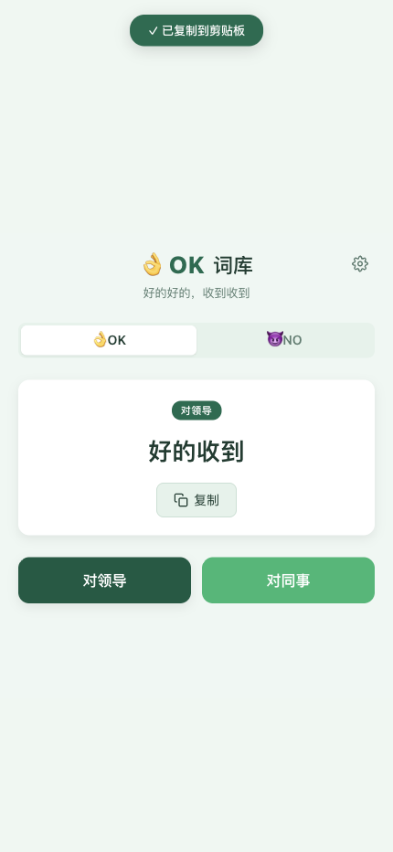
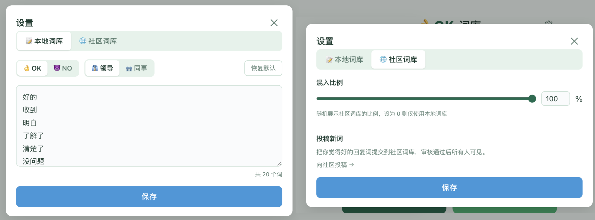
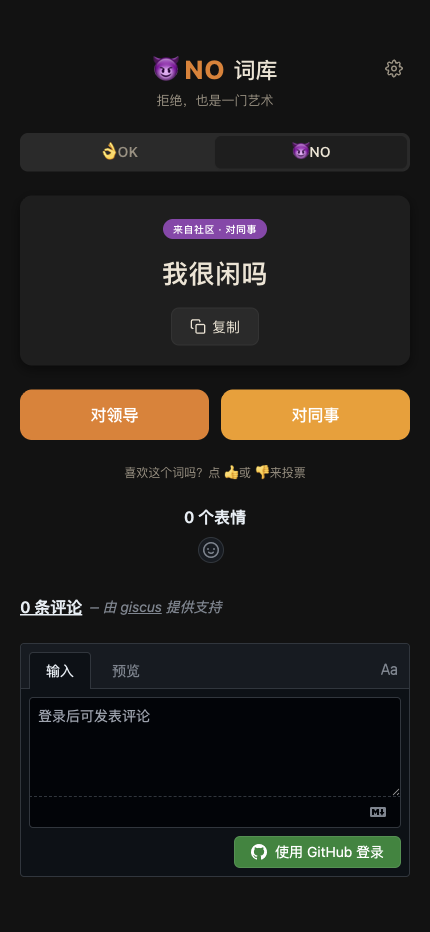
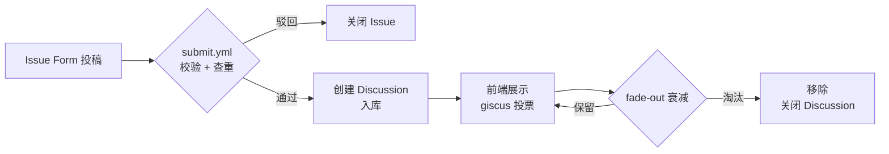

## 页面截图

| 👌 模式 | 😈 模式 | 随机词条 | 设置 | 社区词条 |
|---|---|---|---|---|
|  |  |  |  |  |

## 社区词条的生命周期

```mermaid
flowchart LR
    A[Issue Form 投稿] --> B{submit.yml\n校验 + 查重}
    B -->|驳回| C[关闭 Issue]
    B -->|通过| D[创建 Discussion\n入库]
    D --> E[前端展示\ngiscus 投票]
    E --> F{fade-out 衰减}
    F -->|保留| E
    F -->|淘汰| G[移除\n关闭 Discussion]
```