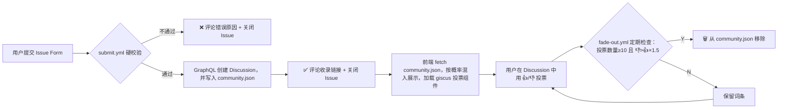

## 页面截图

| 👌 模式 | 😈 模式 | 随机词条 | 设置 | 社区词条 |
|---|---|---|---|---|
|  |  |  |  |  |

## 社区词条的生命周期

```mermaid
flowchart LR
    A[用户提交 Issue Form] --> B{submit.yml 硬校验}
    B -->|不通过| C[❌ 评论错误原因 + 关闭 Issue]
    B -->|通过| D[GraphQL 创建 Discussion，并写入 community.json]
    D --> E[✅ 评论收录链接 + 关闭 Issue]
    E --> F[前端 fetch community.json，按概率混入展示，加载 giscus 投票组件]
    F --> G[用户在 Discussion 中\n用 👍/👎 投票]
    G --> H{fade-out.yml 定期检查：\n 投票数量≥10 且 👎>👍×1.5 }
    H -->|Y| L[🗑️ 从 community.json 移除]
    H -->|N| M[保留词条]
    M --> G
```